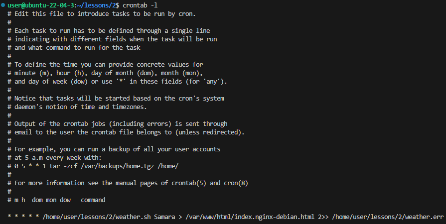
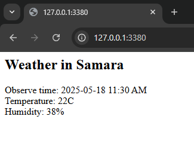

# Lab2: Cron jobs + bash scripts + curl + jq + nginx

## Было сделано

- Написан скрипт [weather.sh](weather.sh), который выполняет запрос погоды с сервиса https://wttr.in/. Его аргументом выступает название города, погоду которого хотим узнать
- Установлен nginx сервер на vm
- Добавлена работа в список [cron jobs](crontab) для записи вывода скрипта [weather.sh](weather.sh) в файл страницы nginx по умолчанию
- Проброшен порт для доступа к nginx в virtual box

## Скриншоты:

**Cron jobs**

**Замененная страница по умолчанию nginx**

